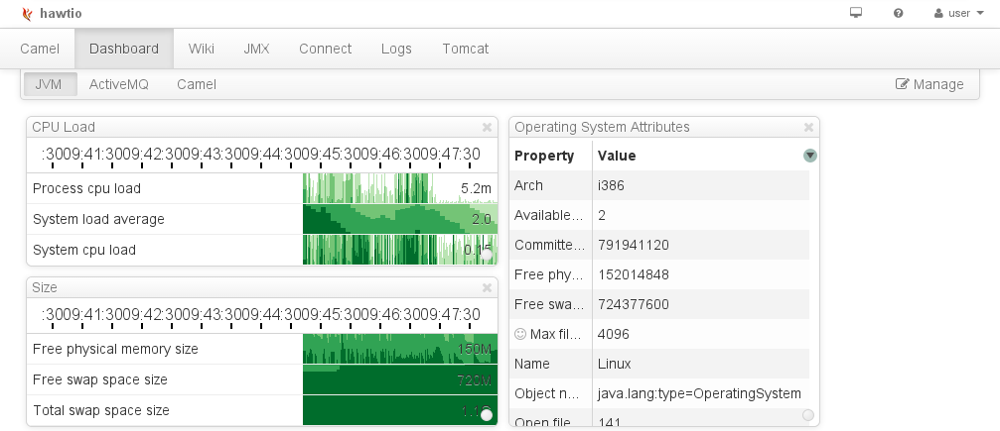
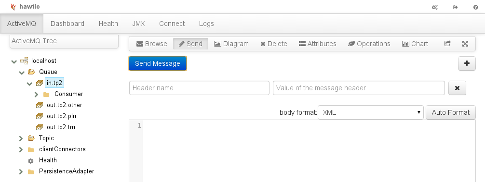
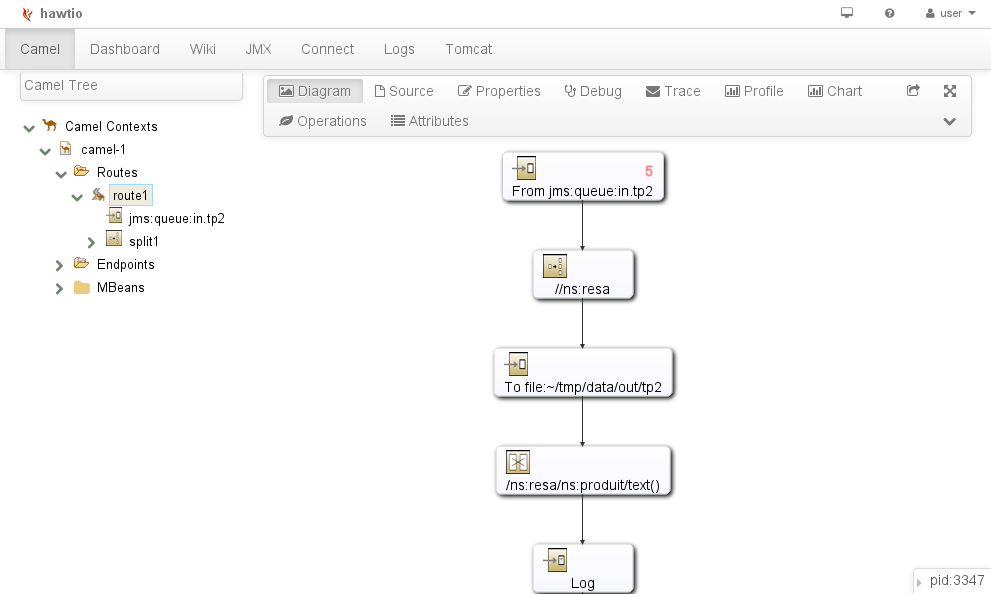
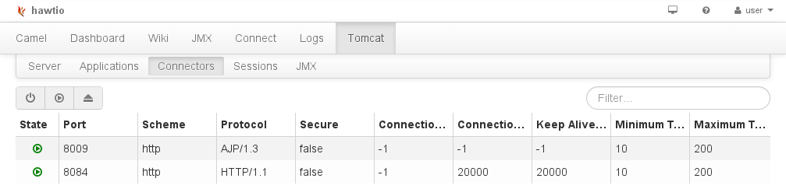
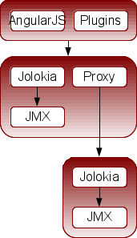

# HawtIO, la console web polyvalente

[HawtIO](http://hawt.io) est développé chez RedHat par l'équipe qui a produit 
ActiveMQ, Camel, ServiceMix, Karaf, etc. Ce projet est probablement né de la 
volonté d'avoir une console web commune pour administrer et monitorer tous ces 
produits. Mais finalement HawtIO va plus loin que ça et permet de monitorer 
n'importe quelle type d'application ou de serveur.

HawtIO vient de souffler sa première bougie et de sortir une nouvelle version 1.2: 
c'est l'occasion idéale de présenter l'outil.

## Utilisation

### Quelques exemples

Il n'y a pas de console d'administration sans affichage des métriques classiques 
de la JVM: occupation de la heap, nombre de threads, charge CPU... HawtIO ne 
déroge pas à la règle

Depuis la dernière version 5.9 d'ActiveMQ, HawtIO est intégré dans le broker 
JMS/AMQP/STOMP et permet d'administrer les queues: envoyer des messages, 
monitorer leur remplissage, rejouer les messages des DLQ (Dead Letter Queues)...

Dès que l'outil aura gagné en maturité, il est fort probable que l'ancienne 
console disparaîtra. Cette [Vidéo](http://vimeo.com/74332231) montre 
l'utilisation d'HawtIO pour administrer ActiveMQ.

Jusqu'ici, pour administrer Apache Camel, il fallait passer par 
JMX. Aujourd'hui, HawtIO permet de démarrer/arrêter les routes, monitorer les 
flux de communication depuis un navigateur. Il est même possible d'avoir un 
représentation graphique des routes voire, sur ServiceMix, de les modifier.

Pour Apache Tomcat, on peut piloter les applications déployées, observer les 
sessions HTTP. Je regrette qu'il manque le monitoring des DataSources, mais 
c'est un bon début... et peut-être la fin du manager actuel?

Pour aller plus loin, HawtIO s'intègre aussi avec:
* ElasticSearch pour monitorer les indexes,
* Kibana 3 pour fouiller dans ses logs,
* Maven et Nexus pour retrouver les sources,
* Jetty, JBoss/WildFly pour faire comme Tomcat
* Infinispan, pour visualiser les caches
* Etc.

### Tableau de bord personnalisé

L'outil permet de se constituer ses propres tableaux de bord. Voici, par exemple 
la recette pour tracer le graphique d'une ou plusieurs métriques JMX dans un 
écran dédié:

1. Ajouter un écran: Dans l'onglet Dashboard, 
	1. cliquer sur Manage, 
	2. puis sur Create
2. Ajouter les métriques: Dans l'onglet JMX,
	1. naviguer dans l'arbre JMX et chercher le MBean comme dans VisualVM ou JConsole
	2. cliquer sur Chart, puis Edit Chart
	3. sélectionner les propriétés intéressantes
	4. cliquer sur la flèche (Add this view to Dashboard)
3. De retour dans l'onglet Dashboard,
	1. selectionner l'écran cible
	2. cliquer cliquer sur Add View to Dashboard

On peut aussi ramener dans un écran les attributs ou les opérations d'un MBean 
et se constituer ainsi un portfolio.

## Configuration

### Anatomie du projet

Au commencement, il y avait des MBeans JMX exposés au niveau JVM, un MBean est constitué de
propriétés (métriques, informations, paramétrage) et des opérations 
(démarrer, arrêter). Ces MBeans sont rendus accessibles sur HTTP grâce à la 
librairie [Jolokia](http://jolokia.org). Autrement dit une API REST permet 
d'accéder aux métriques présentées dans JMX par les outils comme la JVM, ActiveMQ ou 
Camel.

Pour l'affichage, le frontend est développé dans l'écosystème Angular JS (Grunt, 
Angular UI, Twitter Bootstrap, D3 JS...). Il accède naturellement au backend par 
l'API REST Jolokia. L'essentiel du code est écrit en TypeScript, un espèce de 
CoffeeScript made in Microsoft, mais ce n'est pas imposé.

Il est possible de sauvegarder la configuration des Dashboards côté backend. Les
modifications peuvent même être historisées dans un référentiel Git (JGit pour être précis). 
Le même principe de sauvegarde s'applique aux routes Camel déployées dans JBoss Fuse et à 
l'aide en ligne stockée sous forme de Wiki.

HawtIO intègre un proxy HTTP qui permet d'accéder à des métriques situées 
sur d'autres serveurs. Evidemment, il faudra que les serveurs cibles exposent 
leurs MBean sur HTTP via Jolokia.

L'application est décomposée en un ensemble de 
[plugins](http://hawt.io/plugins/index.html) (environ un par technologie serveur) 
qui s'enrichit rapidement: JBoss, ElasticSearch, Wiki... Les plugins côté frontend
s'activent ou non, en fonction de la présence ou non des MBeans appropriés dans 
le backend.

### Lancement

HawtIO se présente sous plusieurs formes. Pour commencer, le plus simple est une 
application autoportée qui démarre ainsi:

	java -jar hawtio-app-1.2.1.jar

Il y a aussi un plugin Maven qui pourra venir épauler le plugin Maven pour
Camel par exemple:

	mvn io.hawt:hawtio-maven-plugin:1.2.1:camel

Si vous utilisez l'ESB Apache ServiceMix, ou sa variante JBoss Fuse, il faudra 
installer une feature Karaf:

	features:addurl mvn:io.hawt/hawtio-karaf/1.2.1/xml/features
	features:install hawtio

Au final, toutes ces méthodes de lancement ont pour objectif d'amener un Jetty à 
exécuter un War. Cette application pourra être déployée dans n'importe quel conteneur de Servlet 
2.4 ou plus.

### Personnalisation 

Cette application web (War) est personnalisable. Pour cela, on crée une nouvelle 
application Web JEE avec 
[Maven](https://github.com/hawtio/hawtio/blob/master/sample/pom.xml), 
et on s'appuie sur les War Overlays:

	<artifactId>hawtio-custom</artifactId>
	<packaging>war</packaging>
	<name>1.0.0-SNAPSHOT</name>
	<dependencies>
		<dependency>
			<groupId>io.hawt</groupId>
			<artifactId>hawtio-default</artifactId>
			<version>1.2.0</version>
			<type>war</type>
		</dependency>

A partir de là, on a carte blanche pour ajouter du code aussi bien côté 
backend Java que côté frontend JS. 

### Sécurisation

Pour sécuriser l'accès à l'application, il y a plusieurs façons de procéder
mais au final toutes passent par la dérivation de l'application web et la
personnalisation du web.xml.

Dans la sphère Apache ActiveMQ/ServiceMix, la personnalisation de HawtIO utilise
un filtre et des servlets:

    <filter>
      <filter-name>AuthenticationFilter</filter-name>
      <filter-class>io.hawt.web.AuthenticationFilter</filter-class>
    </filter>
	<servlet>
	  <servlet-name>login</servlet-name>
	  <servlet-class>io.hawt.web.LoginServlet</servlet-class>
	</servlet>
	<servlet>
	  <servlet-name>logout</servlet-name>
	  <servlet-class>io.hawt.web.LogoutServlet</servlet-class>
	</servlet>

Ces classes Java s'appuient sur la mécanique JAAS de Realm/LoginModule 
qui sont configurées dans un fichier login.config...

	activemq {
		org.apache.activemq.jaas.PropertiesLoginModule required
			org.apache.activemq.jaas.properties.user="users.properties"
			org.apache.activemq.jaas.properties.group="groups.properties";
	};

... ainsi que quelques propriétés d'environnement

	-Djava.security.auth.login.config=$ACTIVEMQ_CONF/login.config
	-Dhawtio.realm=activemq 
	-Dhawtio.role=admins 
	-Dhawtio.rolePrincipalClasses=org.apache.activemq.jaas.GroupPrincipal 

On aurait pu choisir une autre implémentation de LoginModule comme [celles incluses
à Java](http://docs.oracle.com/javase/7/docs/jre/api/security/jaas/spec/com/sun/security/auth/module/package-summary.html).

Un autre façon de faire, plus traditionnelle est de s'appuyer sur les capacités 
du conteneur JEE, on ajoute quelques restrictions d'accès dans le web.xml:

	<security-constraint>
		<web-resource-collection>
			<web-resource-name>hawtio</web-resource-name>
			<url-pattern>/auth/*</url-pattern>
			<url-pattern>/jolokia/*</url-pattern>
			<url-pattern>/upload/*</url-pattern>
		</web-resource-collection>
		<auth-constraint>
			<role-name>hawtio</role-name>
		</auth-constraint>
	</security-constraint>
	<security-role>
		<role-name>hawtio</role-name>
	</security-role>
	<login-config>
		<auth-method>BASIC</auth-method>
		<realm-name>hawtio</realm-name>
	</login-config>

## Conclusion

Plus qu'un outil de monitoring, HawtIO est un framework léger pour construire 
sa propre application de surveillance. Pour l'heure, il manque à mon humble avis 
quelques éléments essentiels comme l'agrégation temporelle (pour une analyse 
post mortem par exemple), l'agrégation horizontale (tous les noeuds d'un cluster) et 
l'agrégation verticale (quelques métriques système). Le fait que cet outil, certes encore 
jeune, soit extensible et basé sur les technologies courantes en 2013 
(JMX, Rest, Angular JS, Git) devrait lui assurer un bel avenir.

Quelques exemples d'utilisation:

* [Vidéo HawtIO dans le Cloud](http://vimeo.com/68442425)
* [Vidéo HawtIO sur JBoss Fuse](http://vimeo.com/80625940)

