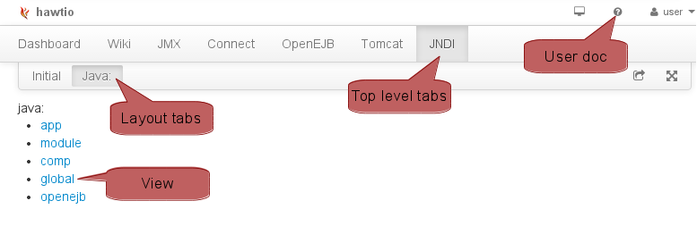
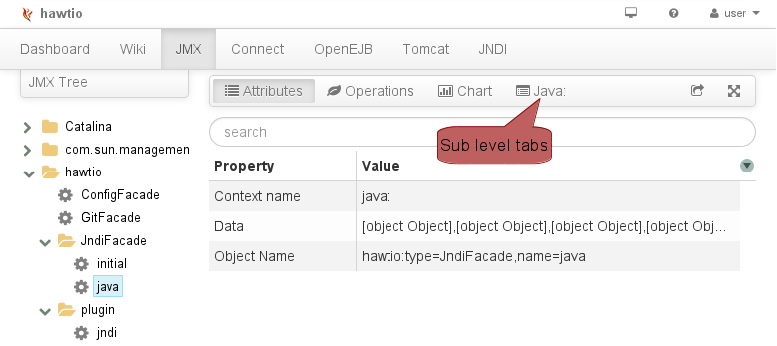

# HawtIO, écrire un plugin

Après avoir découvert dans un [premier article](hawtio-intro.md) les fonctionnalités de HawtIO, nous
allons à présent voir comment développer son propre plugin. 

L'exemple qui illustre cet article a pour objectif d'afficher dans un écran dédié de la 
console HawtIO, le contenu du registre JNDI d'un serveur d'application. Le code source 
de l'application est disponible dans [GitHub Zenika](https://github.com/Zenika/Blogs/20140101_HawtIO/).

## Côté backend

### Créer un MXBean

Pour créer un MBean JMX, il n'est nul besoin d'utiliser HawtIO, mais l'outil
propose une classe de base `MBeanSupport` assez pratique. Elle se charge de 
l'enregistrement dans le serveur JMX. On écrira donc quelque chose du genre:

	/** Interface */
	@MXBean
	public interface JndiFacadeMXBean {
		...
	}
	/** Implémentation */
	public class JndiFacade extends MBeanSupport implements JndiFacadeMXBean {
		...
	}

Pour rappel, apparus avec JMX 2/Java 6, les MXBeans sont une extension et une
simplification des MBeans JMX. Ils
limitent les types autorisés dans la valeurs de retour et les paramètres mais 
permettent tout de même d'échanger des objets Java simples et augmentent les chances de 
compatibilité des applications clientes.

Pour en savoir plus:

* [Qu'est un MXBean par le Spec lead de la JSR 255 JMX 2](https://weblogs.java.net/blog/emcmanus/archive/2006/02/what_is_an_mxbe.html)
* [Les MXBeans dans le tutoriel JMX](http://docs.oracle.com/javase/tutorial/jmx/mbeans/mxbeans.html)
* [Les MXBeans dans la JavaDoc](http://docs.oracle.com/javase/7/docs/api/javax/management/MXBean.html)

### Apache Aries Blueprint

[Blueprint](http://wiki.osgi.org/wiki/Blueprint) est une spécification d'un 
framework d'injection de dépendances adaptée aux conteneurs OSGi.
Apache Aries est une implémentation de Blueprint 
ainsi qu'un ensemble de composants de base (JTA, JPA, JNDI...) pour OSGI et Blueprint. 
En clair, c'est une sorte de Spring, en différent; Blueprint est par exemple utilisé dans 
Apache ServiceMix. HawtIO peut s'appuyer sur Blueprint, même si ce n'est pas une obligation. 

Pour découvrir Blueprint:

* [Une présentation de Blueprint par IBM](http://www.ibm.com/developerworks/opensource/library/os-osgiblueprint/index.html)
* [Apache Aries Blueprint](http://aries.apache.org/modules/blueprint.html)

Comme Spring, Blueprint se configure avec des fichiers XML (la syntaxe est
quasi identique) et gère le cycle de vie des objets:

	<blueprint xmlns="http://www.osgi.org/xmlns/blueprint/v1.0.0"
			xmlns:ext="http://aries.apache.org/blueprint/xmlns/blueprint-ext/v1.2.0">
		<bean id="javaJndiFacade" class="io.hawt.jndi.JndiFacade" 
				init-method="init" destroy-method="destroy" scope="singleton">
			<property name="contextName" value="java:"/>
		</bean>
	</blueprint>

La méthode `init` se charge d'enregistrer le MBean dans la registre JMX, et 
inversement avec la méthode `destroy`.

### La découverte de plugins

Côté backend, BluePrint permet la modularité d'HawtIO. Au démarrage de l'application
HawtIO, BluePrint parcourt les Jars présents dans le classpath à la recherche de 
fichiers `OSGI-INF/blueprint/blueprint.xml`, puis instancie et configure les beans 
(des MXBean par exemple) comme tout conteneur d'injection de dépendances qui se respecte. En ajoutant 
un Jar sur le classpath d'HawtIO, on peut donc faire apparaître des MBeans dans 
le registre JMX.

Coté frontend, pour découvrir dynamiquement les plugins additionnels, HawtIO recherche dans le
registre JMX, les MBeans de type `plugin` dans le domaine JMX `hawtio`.
Pour cette raison, on déclare un second MBean dans Blueprint comme précédemment, à ceci près 
que l'implémentation est fournie par HawtIO cette fois:

		<bean id="jndiPlugin" class="io.hawt.web.plugin.HawtioPlugin" 
				init-method="init" destroy-method="destroy">
			<property name="name" value="jndi"/>
			<property name="context" value="/hawtio"/>
			<property name="scripts" value="app/jndi/js/jndiPlugin.js,app/jndi/js/jndiController.js"/>
		</bean>

On obtient ainsi un MBean nommé `hawtio:type=plugin,name=jndi`. La propriété 
`scripts` donne la liste de fichiers JavaScript que devra charger
dynamiquement le navigateur.

## Côté frontend

C'est de l'AngularJS pur jus: je ne détaillerai guère l'utilisation de ce framework.

### Initialisation du plugin

On créé un module AngularJS dans lequel on déclare des routes.
Lorsque le module démarre (fonction `run`), on inscrit dans des registres: 

* la documentation (`addUserDoc`),
* les onglets de premier niveau (`topLevelTabs`), 
* les onglets dans la vue JMX (`subLevelTabs`)
* et le module lui même (`addModule`).

Au niveau du code, ça donne:

	angular.module('Jndi', ['hawtioCore'])
			.config(function($routeProvider) {
				$routeProvider
						.when('/jndi', {templateUrl: 'app/jndi/html/jndi.html'})
						.when('/jndi/:name', {templateUrl: 'app/jndi/html/jndi.html'});
			})
			.run(function(workspace, viewRegistry, helpRegistry) {
				viewRegistry["jndi"] = "app/jndi/html/layoutJndiTabs.html";
				// Documentation
				helpRegistry.addUserDoc("jndi", 'app/jndi/doc/help.md', function() {
					return workspace.treeContainsDomainAndProperties('hawtio', {type: 'JndiFacade'});
				});
				// Onglet premier niveau
				workspace.topLevelTabs.push({
					id: "jndi",
					content: "JNDI",
					title: "Browse JNDI registry",
					isValid: function(workspace) {
						return workspace.treeContainsDomainAndProperties('hawtio', {type: 'JndiFacade'});
					},
					href: function() {
						return "#/jndi";
					}
				});
				// Onglet niveau JMX
				workspace.subLevelTabs.push({
					content: '<i class="icon-list-alt"></i> Java:',
					title: "Java: Context",
					isValid: function(workspace) {
						return workspace.hasDomainAndProperties('hawtio', {type: 'JndiFacade', name: "java"});
					},
					href: function() {
						return "#/jndi/java";
					}
				});
			});
	hawtioPluginLoader.addModule('Jndi');

Vous remarquerez au passage que les onglets apparaissent ou pas en fonction
de la présence ou pas d'un MBean donné: `workspace.hasDomainAndProperties`. 
HawtIO va assez loin dans la dynamicité: par exemple, l'arrêt d'une application
provoque le dés-enregistrement de MBeans donnés côté backend, aussitôt les
onglets associés vont disparaître dans le frontend.

### Layout

Dans l'initialisation ci-dessus, on a déclaré dans le `viewRegistry` un layout, 
celui-ci donne la mise en page globale de l'écran.

	<ul class="nav nav-tabs" ng-controller="Core.NavBarController">
		<!-- Onglet niveau layout -->
		<li ng-class='{active : isActive("#/jndi/java")}'>
			<a ng-href="{{link('#/jndi/java')}}">Java:</a>
		</li>
	</ul>
	

		

	

Contrairement aux autres, les onglets du niveau layout sont décrits en HTML.

### Vue, Contrôleur et Documentation

Ici aussi c'est de l'AngularJS classique, je vous épargnerai donc les détails:

	Jndi.JndiController = function($scope, $routeParams, jolokia) {
		$scope.context = {id: $routeParams.name};
	}
	

		{{context.id}}
	

Dans le contrôleur, on utilise
l'[API JavaScript Jolokia](http://www.jolokia.org/reference/html/clients.html#client-javascript) 
pour aller chercher des informations sur le backend.

		jolokia.getAttribute("hawtio:type=JndiFacade,name=java","ContextName",{
			method:"POST",
			success:function(response) {
				$scope.context.name=response;
				$scope.$apply();
			}
		});

Vous noterez, que comme Jolokia JS ne s'appuie pas sur le `$http` d'Angular mais
sur JQuery, on est contraint d'invoquer `$apply` dans les callbacks pour que la
vue soit mise à jour.

En ce qui concerne l'aide en ligne du plugin, c'est un simple fichier écrit en MarkDown.

## Conclusion

Le développement de plugins HawtIO n'est pas sorcier, l'outil est vraiment
conçu avec l'extensibilité en ligne de mire. On regrettera cependant que la documentation
soit pauvre (pas JSDoc pour l'instant), il faudra donc disséquer un peu le 
code source.

Quelques pointeurs:

* [Qu'est-ce qu'un plugin HawtIO?](http://hawt.io/plugins/howPluginsWork.html)
* [Développer dans HawtIO](https://github.com/hawtio/hawtio/blob/master/DEVELOPERS.md)
